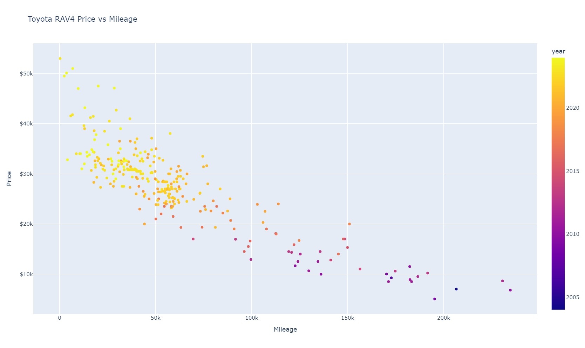
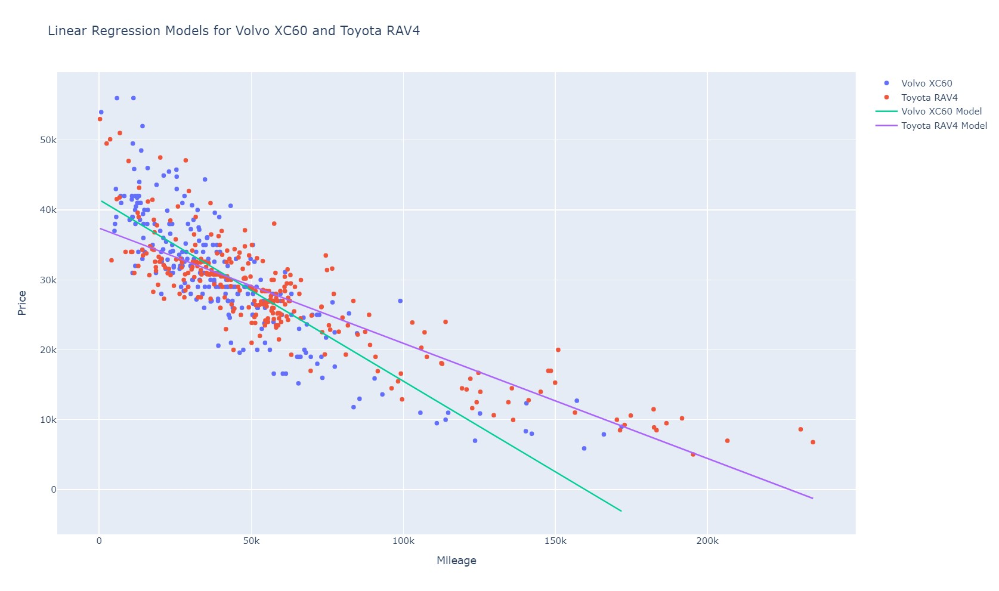
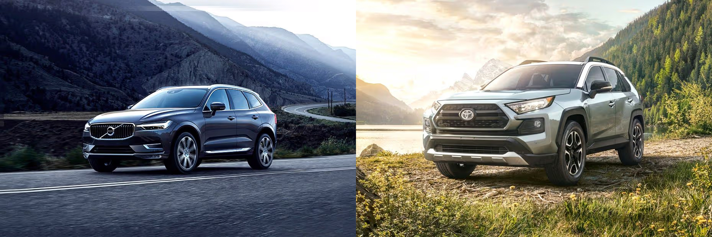

# Vehicle-Research
This analysis is an extension of an assignment completed for a Statistical Modeling course at the Colorado School of Mines. For the assignment, we were asked to select a vehicle to research and create a linear regression model to predict the used vehicle price based on the mileage. Dr Munson provided a simple data download (linked below) that utilized data from AutoTrader.

As I have been researching future car options, I have noticed a steep drop in price for Volvo XC60s, as the owners of these luxury vehicles often prefer the brand new option. With the typical 40% decline in price in the first three years of ownership, I was curious if a gently used XC60 would be similar in price to a Rav4.

Our original assignment was completed in R, but I wanted to experiment with the same analysis utilizing Python and additionally do a comparison of the regression models between the XC60 and the Rav4.

## Used Vehicle Datasets
Both CSV files in my repository were pulled in February of 2025. Since the easy download option did not include an XC60, I created a script to scrape the Edmunds.com website. I chose Edmunds because the html structure was easier to parse with selenium than Auto Trader; the datasets between AutoTrader and Edmunds seem to be coming from a shared database. Both datasets were pulled for my Denver Metro area.

[Easy Data Option](http://myslu.stlawu.edu/~clee/dataset/autotrader/)

## Scraping Edmunds.com
For  those looking to complete a similar datascrape, I included detailed comments in my code. Issues of note:

* AutoTrader was harder to scrape than Edmunds, I switched website sources as the data looked to be the same
* Selenium struggled to interact with the "Next page" elements, I used a pagination loop instead
* The web scraping script kept timing out, I added a loop to skip pages with loading issues
* To accomodate for the batch loading of pages, I modified the CSV data load to operate in batches to prevent data loss

Utilizing both the loop to skip pages the and code to pull pages in batches was needed to retrieve the vehicle data without error.

## Cleaning the data

The simple data pull link provided by my instructor provided already cleaned vehicle data. The scraped data from Edmunds required further manipulation. I stripped the year from the vehicle title and also removed the dollar sign from the price. Additionally, the price, year and mileage columns needed to be declared as integers, as the data was pulled as text strings.

# Volvo XC60 vs the Toyota Rav4

I have driven Toyotas my entire life, starting with a Toyota Corolla. I drove this vehicle until it reached 260,000 miles and have now been driving a Toyota Sienna for the past ten years. I love the durability of Toyotas, but I am also very drawn to the aesthetic and comfort of the Volvo XC60. The rapid depreciation of the XC60 is making me consider this as an option.

Below you can see my exploratory data analysis of the XC60 and Rav4. Note that the price is the response (y) variable, and the mileage is the explanatory (x) variable. I added color to the scatterplot to visualize the year of the vehicles; all vehicle sales are *used listings*.

### Rav4 Exploratory Analysis

Looking at the scatterplot, I notice that there is a large cluster of available vehicles that are 5 years or newer with less than 50,000 miles. I also find it interesting that there are three vehicles for sale over the 200,000 mileage point. The Volvo data does not have a single vehicle for sale with over 180,000 miles. This observation aligns with the known durability of Toyotas, which also accounts for the slower depreciation.

### XC60 Exploratory Analysis

The Volvo XC60 depreciation difference is less obvious on a scatterplot. Of note, the oldest XC60 is from 2010. The oldest Rav4 was from 2005. The next step was to fit a linear model to each of the datasets to get a clearer understanding of each vehicles depreciation.

# Making an informed decision

Looking at the combined linear models, the Volvo XC60 has a notably steeper drop in value as mileage increases. The two linear models intersect at 44,000 miles, indicating that a Rav4 and XC60 are predicted to have the same price at this mileage. Seeing the two datasets together, I became hopeful that math would indeed justify the purchase of a gently used Volvo XC60.

Looking at the models below, the y-intercept for the Volvo XC60 begins at $41,459, higher than the $37,382 y-intercept for the Rav4. This is not surprising, as the starting cost of the XC60 is significantly higher than the Rav4.

Both models have a similar R^2 value. For the Volvo XC60, 71% of the variability is explained by the model, while 74% of the variability is explained by the model for the Rav4. Additionally, the Volvo XC60 has a larger standard error, indicating that predictions are often off by $4,906. This error is $855 more than the Rav4. The Volvo XC60 does appear to have a broader range of trim levels, which could account for this extra variability.

### Volvo XC60 Linear Regression Model
Regression equation: predicted_price = 41459.0 -0.26 * mileage  
R^2: 0.71   
Standard Error: 4906.31  
Vehicles in the data set: 251  

Simply put, for every increase in mileage, the predicted price of a Volvo XC60 decreases by $.26.

### Toyota Rav4 Linear Regression Model
Regression equation: predicted_price = 37392.46 -0.16 * mileage  
R^2: 0.74  
Standard Error: 4051.23  
Vehicles in the data set: 300  

For every increase in mileage, the predicted price of a Toyota Rav4 decreases by $.16. Looking only at mileage depreciatation, the Toyota Rav4 is approximately ten cents cheaper to drive per mile than the Volvo XC60.

Note: I did not assess for LNE conditions in this notebook. In my R exercise, I found powering down the mileage values, taking the square root of the explanatory, had a significant improvement on linearity, normality and equal variance of the residuals. This transformation additionally improved my R^2 value. 

*For the non-statisticians*, taking the square root of mileage and then creating a predictive model improved the accuracy.

# Calculating cost of ownership

I pulled the five year cost of ownership for both the Volvo XC60 and the Toyota Rav4 from Edmunds.com. Costs included fuel, maintenance, repairs, and insurance. I did not include the depreciation, as this is accounted for in my model. Edmmunds did note that the Volvo XC60 depreciates $32,044 in the first five years, while the Toyota Rav4 depreciates by $14,412.

For the first five years, the Volvo XC60 has a total cost of ownership of $25,654 and the Toyota Rav4 has a total cost of ownership of $20,239.
The Volvo XC60 is $5,415 more expensive to own than the Toyota Rav4 for the first five years. Premium fuel and repair costs are the biggest contributors to the difference in cost of ownership.

## Calculating net cost

Originally, I tried to predict the cost of both the XC60 and Rav4 at 175,000 miles, when I predict I would sell this vehicle. I ended up with a negative predicted value for the Volvo... I changed the code to predict the ending prices for each vehicle at 150,0000 to account for this limitation in my model.

* Predicted price for a Volvo XC60 with 150,000 miles: $2,564
* Predicted price for a Toyota Rav4 with 150,000 miles: $12,695 (impressive)

After predicting the value of the vehicles when it was time to pass them along to the next owner, I took the original predicted purchase price at 40,000 miles, added the five year cost of ownership for five years, and then subtracted the vehicle's final estimated value at 150,000 miles.

* The predicted net ownership cost for the Volvo XC60 is $54,177
* The predicted net ownership cost for the Toyota Rav4 is $38,350

When purchasing at 40,000 and selling at 150,000 and considering cost of ownership, the Volvo XC60 is predicted to be $15,826 more expensive than the Toyota Rav4.

# Conclusion
While the rapid depreciation of the Volvo XC60 confirmed my hypothesis that a XC60 and Rav4 are similar in price at 40,000 miles, the Volvo XC60 is predicted to be 41.3% more expensive than the Rav4 over if purchased at 40,000 miles and driven until it reaches 150,000  miles.

### Considerations
The Volvo XC60 data was sourced from Edmunds.com and the Rav4 data was pulled from a tool using Auto Trader. I noticed that some of the Edmunds values came from Carvana. While I had used a local search for the Edmunds.com web scraping, doing a scrape for both the Volvo XC60 and Toyota Rav4 would have been a better analysis.

Further, the cost of ownership was calculated for the first *five years of ownership*, while I am predicting the ownership starting around year three and ending closer to year eleven or twelve. My pricing model should calculate closer to nine years of ownership and should be higher as older cars tend to have higher maintenance and repair costs.

Creating confidence intervals for my pricing would have been an interesting analysis, as the Volvo XC60 predictions showed greater variability.

In the end, purchases do not need to be purely mathematical. Sometimes an item is worth more because of the comfort and fun factor. The true questions is, do I find the vehicle aesthetic, comfort and fun factor of the XC60 worth the approximately $150 extra monthly cost?

*I predict a Rav4 is in my future.*