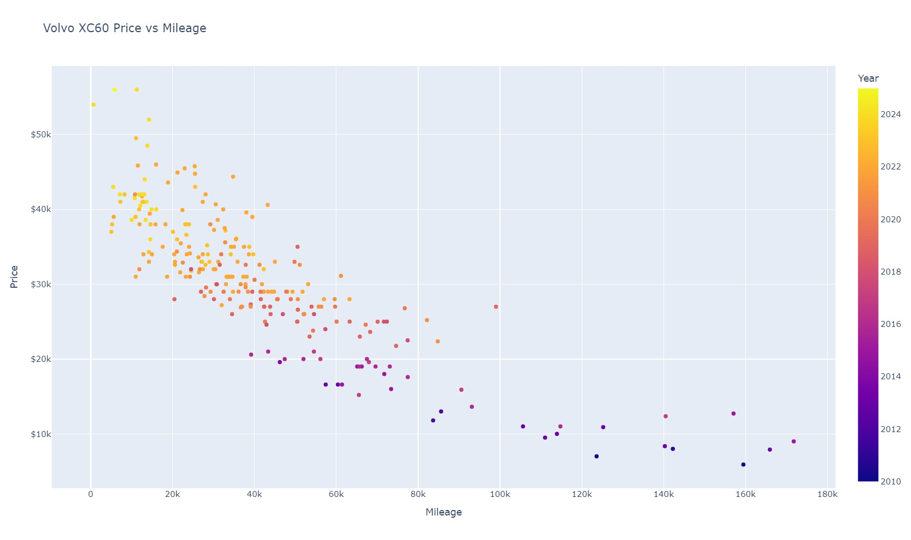

# Vehicle-Research
This analysis is an extension of an assignment completed for a Statistical Modeling course at the Colorado School of Mines. For the assignment, we were asked to select a vehicle to research and create a linear regression model to predict the vehicle price based on the mileage. Dr Munson provided a simple data download (linked below) that utilized data from AutoTrader.

As I have been researching future car options, I have noticed a steep drop in price for Volvo XC60s, as the owners of these luxury vehicles often prefer the brand new option. With the typical 40% decline in price in the first three years of ownership, I was curious if a gently used XC60 would be similar in price to a Rav4.

Our original assignment was completed in R, but I wanted to experiment with the same analysis utilizing Python and additionally do a comparison of the regression models between the XC60 and the Rav4.

# Used Vehicle Datasets
Both CSV files in my repository were pulled in February of 2024. Since the easy download option did not include an XC60, I created as script to scrape the Edmunds.com website. I chose this site because the html structure was easier to parse with selenium. The datasets between AutoTrader and Edmunds seem to be coming from a shared database. Both datasets were pulled for my area code, which is in the Denver Metro area.

[Easy Data Option](http://myslu.stlawu.edu/~clee/dataset/autotrader/)

## Scraping Edmunds.com
For  those looking to complete a similar datascrape, note the comments added to my notebook. Selenium was not able to understand the "next page" detection using a div based blick. I noticed that each additional page had "&pagenumber=#" to the end of the url. I created a loop to scrape one page at a time, increasing the page by one for each loop.

I had issues with the web driver timing out and certain pages in particular kept stalling the script. I updated my notebook to save each newly scraped page to the csv file and included a page number column. Looking at the csv, I could easily identify what data was properly saved to my file. When my script stalled on page 3, I started the web scrape again setting the page number equal to one. Since my look increases by one each time, the script began on page four and successfully pulled the remaining pages.

I additionally created a loop to allow the web scraping code to skip pages that failed to load properly.

Utilizing both the loop to skip pages that loaded poorly and code to pull each page in batches was needed to successully pull the necessary data.

## Cleaning the data

The simple data pull link provided by my instructor pulled already cleaned vehicle data. The scraped data from Edmunds required further manipulation. I needed to strip the year from the vehicle title, and also remove the dollar sign from the price. Additionally, the numeric columns needed to be declared as integers, as the data was pulled as text strings.

# Volvo XC60 vs the Toyota Rav4

I have driven Toyotas my entire life, starting with a Toyota Corolla. I drove this vehicle until it reached 260,000 miles and have now been driving a Toyota Sienna for the past ten years. I love the durability of Toyotas, but I am also very drawn to the aesthetic and comfort of the Volvo XC60. I would never consider purhcasing a new one, but the rapid depreciation is making me consider the XC60 as an option.

Below you can see my exploratory data analysis of the XC60 and Rav4. Note that the price is the response (y) variable, and the mileage is the explanatory (x) variable. I added color to the scatterplot to visualize the year of the vehicles.

